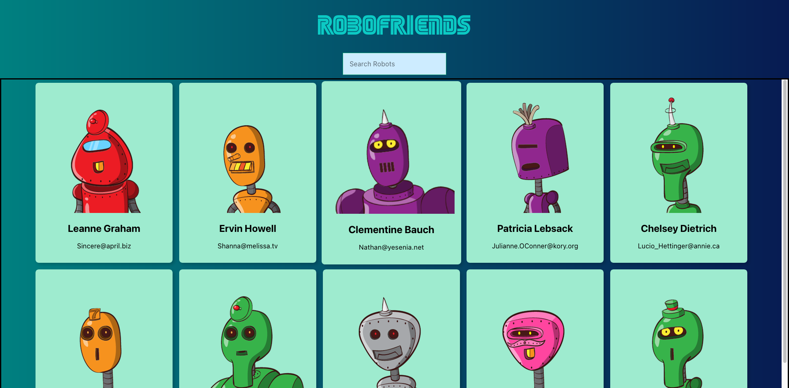

# RoboFriends - A React Application

RoboFriends is a React application that dynamically populates and allows users to search through a list of robots displayed on individual card components. This README provides an overview of the application's structure and functionality.

## Table of Contents

- [Introduction](#introduction)
- [Screenshot](#screenshot)
- [Getting Started](#getting-started)
- [Features](#features)
- [Code Structure](#code-structure)
- [Installation](#installation)
- [Usage](#usage)
- [Contributing](#contributing)
- [License](#license)

## Introduction

RoboFriends is a simple and interactive web application that utilizes React to create a list of robot profiles. Users can search for specific robots by name, and the application dynamically filters the displayed robots based on the search query.

## Screenshot

## Getting Started

To run the RoboFriends application locally, follow these steps:

1. Clone this repository to your local machine.
2. Open your terminal and navigate to the project directory.
3. Run `npm install` to install the necessary dependencies.
4. Run `npm start` to start the development server.
5. Open your web browser and go to [http://localhost:3000](http://localhost:3000) to access the application.

## Features

RoboFriends offers the following features:

- Displays a list of robot profiles as individual card components.
- Allows users to search for robots by name, dynamically updating the card display.
- Provides a loading screen while fetching robot data from a remote server.

## Code Structure

The application is structured into components as follows:

- `App.js`: The main component that manages the state, fetches robot data, and handles user search input.
- `CardList.js`: Displays a list of robot cards.
- `SearchBox.js`: Provides a search input box for users to enter their search queries.
- `Scroll.js`: Wraps the card list, enabling smooth scrolling.

## Installation

To install and run the RoboFriends application, follow the [Getting Started](#getting-started) instructions.

## Usage

Once the application is running locally, you can perform the following actions:

- Enter a robot name in the search box to filter the displayed robots.
- Scroll through the list of robot cards to view their profiles.

## Contributing

Contributions to the RoboFriends project are welcome. If you'd like to contribute, please follow these steps:

1. Fork the repository.
2. Create a new branch for your feature or bug fix.
3. Make your changes and commit them with descriptive messages.
4. Push your changes to your fork.
5. Create a pull request to the original repository's `main` branch.

## License

This project is licensed under the MIT License - see the [LICENSE.md](LICENSE.md) file for details.

Enjoy using RoboFriends to explore and search through a delightful array of robot profiles! If you have any questions or need assistance, feel free to reach out to Devin, the developer of this application.
